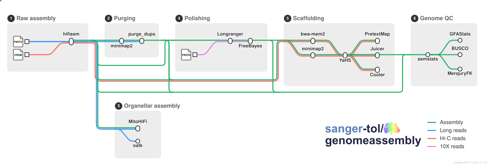

# sanger-tol/genomeassembly

<picture>
  <source media="(prefers-color-scheme: dark)" srcset="docs/images/sanger-tol-genomeassembly_logo_dark.svg">
  
</picture>

[](https://github.com/codespaces/new/sanger-tol/genomeassembly)
[](https://github.com/sanger-tol/genomeassembly/actions/workflows/nf-test.yml)
[](https://github.com/sanger-tol/genomeassembly/actions/workflows/linting.yml)[](https://doi.org/10.5281/zenodo.10391851)
[](https://www.nf-test.com)

[](https://www.nextflow.io/)
[](https://github.com/nf-core/tools/releases/tag/4.1.0)
[](https://docs.conda.io/en/latest/)
[](https://www.docker.com/)
[](https://sylabs.io/docs/)
[](https://cloud.seqera.io/launch?pipeline=https://github.com/sanger-tol/genomeassembly)

## Introduction

**sanger-tol/genomeassembly** is a bioinformatics pipeline for de-novo genome assembly from long read data (PacBio HiFi or ONT), long-range Hi-C data, and optionally Illumina WGS and Illumina 10X linked reads. It is capable of producing primary/alternative assembles, Hi-C phased assemblies using Hi-C data, and trio-binned assemblies using data from parental sequencing.

<picture>
  <source media="(prefers-color-scheme: dark)" srcset="docs/images/sanger-tol-genomeassembly_metro_map_dark_animated.svg">
  
</picture>

## Pipeline summary

The pipeline is designed to be very flexible and nearly all stages of the pipeline are optional, allowing flexible specification of genome assemblies.

1. If FastK databases and coverage information information are not provided, the pipeline first builds these and estimates the genome coverage using [genomescope2](https://github.com/tbenavi1/genomescope2.0).
2. Assembles the provided long reads using [hifiasm](https://hifiasm.readthedocs.io), optionally producing hic-phased or trio-binned assemblies. ONT reads are supported for both primary assembly and as ultra-long reads.
3. (optional) Purges retained haplotigs from the assembly using [purge_dups](https://github.com/dfguan/purge_dups).
4. (optional) Polishes the combined assembly using Illumina 10X reads with [Longranger](https://support.10xgenomics.com/genome-exome/software/pipelines/latest/what-is-long-ranger) and [Freebayes](https://github.com/freebayes/freebayes). This feature is retained for re-production of old ToL assemblies and is not well-tested.
5. (optional) Maps Hi-C reads to each assembly using [bwamem2](https://github.com/bwa-mem2/bwa-mem2) or [minimap2](https://github.com/lh3/minimap2/), and scaffolds them using these long-range Hi-C interactions with [YaHS](https://github.com/c-zhou/yahs).
7. Produces numerical statistics for each assembly at each stage of the pipeline using [GFASTATS](https://github.com/vgl-hub/gfastats) (assembly statiscics), [BUSCO](https://busco.ezlab.org/) (single-copy ortholog statistics), and [MERQURY.FK](https://github.com/thegenemyers/MERQURY.FK) (QV and kmer-completeness).
8. (optional) Assembles organellar genomes (mitochondrion and chloroplast) using the de-novo assembler [oatk](https://github.com/c-zhou/oatk), and the reference-based assembler [MitoHiFi](https://github.com/marcelauliano/MitoHiFi).

## Usage

> [!NOTE]
> If you are new to Nextflow and nf-core, please refer to [this page](https://nf-co.re/docs/get_started/environment_setup/overview) on how to set-up Nextflow. Make sure to [test your setup](https://nf-co.re/docs/get_started/run-your-first-pipeline) with `-profile test` before running the workflow on actual data.

Currently, it is advised to run the pipeline with Docker or Singularity, as `purge_dups` and `mitohifi` do not support running with Conda.

Now, you can run the pipeline using:

```bash
nextflow run sanger-tol/genomeassembly \
   -profile <docker/singularity/.../institute> \
   --genomic_data genomic_data.yaml \
   --assembly_specs assembly_specs.yaml \
   --outdir <OUTDIR>
```

> [!WARNING]
> Please provide pipeline parameters via the CLI or Nextflow `-params-file` option. Custom config files including those provided by the `-c` Nextflow option can be used to provide any configuration _**except for parameters**_; see [docs](https://nf-co.re/docs/running/run-pipelines#using-parameter-files).

## Credits

sanger-tol/genomeassembly was originally written by Ksenia Krashennikova and Jim Downie.

We thank the following people for their extensive assistance in the development of this pipeline:

@priyanka-surana for the code review, very helpful coding suggestions, and assistance with pushing this pipeline forward through development.

@mcshane and @c-zhou for the design and implementation of the original pipelines for purging (@mcshane), polishing (@mcshane) and scaffolding (@c-zhou).

TreeVal team Damon-Lee Pointon (@DLBPointon), Yumi Sims (@yumisims) and William Eagles (@weaglesBio) for implementation of the hic-mapping pipeline.

@muffato for help with nf-core integration, dealing with infrastructure and troubleshooting, for the code reviews and valuable suggestions at the different stages of the pipeline development.

@gq1 for the code review, valuable suggestions to the code improvement and contributions to the full test setup.

@mahesh-panchal for nextflow implementation of the purging pipeline, code review and valuable suggestions to the nf-core modules implementation.

## Contributions and Support

If you would like to contribute to this pipeline, please see the [contributing guidelines](docs/CONTRIBUTING.md).

## Citations

If you use sanger-tol/genomeassembly for your analysis, please cite it using the following doi: [10.5281/zenodo.10391851](https://zenodo.org/records/10391852).

An extensive list of references for the tools used by the pipeline can be found in the [`CITATIONS.md`](CITATIONS.md) file.

This pipeline uses code and infrastructure developed and maintained by the [nf-core](https://nf-co.re) community, reused here under the [MIT license](https://github.com/nf-core/tools/blob/main/LICENSE).

> **The nf-core framework for community-curated bioinformatics pipelines.**
>
> Philip Ewels, Alexander Peltzer, Sven Fillinger, Harshil Patel, Johannes Alneberg, Andreas Wilm, Maxime Ulysse Garcia, Paolo Di Tommaso & Sven Nahnsen.
>
> _Nat Biotechnol._ 2020 Feb 13. doi: [10.1038/s41587-020-0439-x](https://dx.doi.org/10.1038/s41587-020-0439-x).
