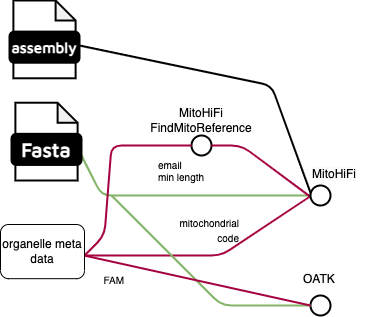

# sanger-tol/genomeassembly: Output

## Introduction

This document describes the output produced by the genomeassembly pipeline.

The directories listed below will be created in the results directory after the pipeline has finished. All paths are relative to the top-level results directory.

## Subworkflows

The pipeline is built using [Nextflow](https://www.nextflow.io/) DSL2.

### PREPARE_INPUT

Here the input YAML is being processed. This subworkflow generates the input channels used as by the other subworkflows.

### GENOMESCOPE_MODEL

  
Output files

  
  - <code>kmer/*ktab</code>
    - kmer table file
  - <code>kmer/*hist</code>
    - kmer histogram file
  - <code>kmer/*model.txt</code>
    - genomescope model in text format
  - <code>kmer/*[linear,log]_plot.png</code>
    - genomescope kmer plots
  

This subworkflow generates a KMER database and coverage model used in [PURGE_DUPS](#purge_dups) and [GENOME_STATISTICS](#genome_statistics) 

### RAW_ASSEMBLY

  
Output files

  
  - <code>.\*hifiasm.\*/.*p_ctg.[g]fa</code>
    - primary assembly in GFA and FASTA format; for more details refer to [hifiasm output](https://hifiasm.readthedocs.io/en/latest/interpreting-output.html) 
  - <code>.\*hifiasm.\*/.*a_ctg.[g]fa</code>
    - haplotigs in GFA and FASTA format; for more details refer to [hifiasm output](https://hifiasm.readthedocs.io/en/latest/interpreting-output.html)
  - <code>.\*hifiasm.\*/.*bin</code>
    - internal binary hifiasm files; for more details refer [here](https://hifiasm.readthedocs.io/en/latest/faq.html#id12)
  

This subworkflow generates a raw assembly(-ies). First, hifiasm is run on the input HiFi reads then raw contigs are converted from GFA into FASTA format, this assembly is due to purging, polishing (optional) and scaffolding further down the pipeline.
In case hifiasm HiC mode is switched on, it is performed as an extra step with results stored in hifiasm-hic folder.

### PURGE_DUPS

  
Output files

  
  - <code>\*.hifiasm..\*/purged.fa</code>
    - purged primary contigs
  - <code>\*.hifiasm..\*/purged.htigs.fa</code>
    - haplotigs after purging  
  - other files from the purge_dups pipeline
    - for details refer [here](https://github.com/dfguan/purge_dups)

Retained haplotype is identified in primary assembly. The alternate contigs are updated correspondingly.
The subworkflow relies on kmer coverage model to identify coverage thresholds. For more details see [purge_dups](https://github.com/dfguan/purge_dups)

### POLISHING

  
Output files

  
  - <code>\*.hifiasm..\*/polishing/.*consensus.fa</code>
    - polished joined primary and haplotigs assembly
  - <code>\*.hifiasm..\*/polishing/merged.vcf.gz</code>
    - unfiltered variants
  - <code>\*.hifiasm..\*/polishing/merged.vcf.gz.tbi</code>
    - index file
  - <code>\*.hifiasm..\*/polishing/refdata-*</code>
    - Longranger assembly indices

This subworkflow uses read mapping of the Illumina 10X short read data to fix short errors in primary contigs and haplotigs.

### HIC_MAPPING

  
Output files

  
  - <code>\*.hifiasm..\*/scaffolding/.*_merged_sorted.bed</code>
    - bed file obtained from merged mkdup bam
  - <code>\*.hifiasm..\*/scaffolding/.*mkdup.bam</code>
    - final read mapping bam with mapped reads  

This subworkflow implements alignment of the Illumina HiC short reads to the primary assembly. Uses [`CONVERT_STATS`](#convert_stats) as internal subworkflow to calculate read mapping stats.

### CONVERT_STATS

  
Output files

  
  - <code>\*.hifiasm..\*/scaffolding/.*.stats</code>
    - output of samtools stats 
  - <code>\*.hifiasm..\*/scaffolding/.*.idxstats</code>
    - output of samtools idxstats
  - <code>\*.hifiasm..\*/scaffolding/.*.flagstat</code>
    - output of samtools flagstat  

This subworkflow produces statistcs for a bam file containing read mapping. It is executed within [`HIC_MAPPING`](#hic_mapping) subworkflow.

### SCAFFOLDING

  
Output files

  
  - <code>\*.hifiasm..\*/scaffolding/yahs/out.break.yahs/out_scaffolds_final.fa</code>
    - scaffolds in FASTA format
  - <code>\*.hifiasm..\*/scaffolding/yahs/out.break.yahs/out_scaffolds_final.agp</code>
    - coordinates of contigs relative to scaffolds
  - <code>\*.hifiasm..\*/scaffolding/yahs/out.break.yahs/alignments_sorted.txt</code>
    - Alignments for Juicer in text format
  - <code>\*.hifiasm..\*/scaffolding/yahs/out.break.yahs/yahs_scaffolds.hic</code>
    - Juicer HiC map
  - <code>\*.hifiasm..\*/scaffolding/yahs/out.break.yahs/*cool</code>
    - HiC map for cooler
  - <code>\*.hifiasm..\*/scaffolding/yahs/out.break.yahs/*.FullMap.png</code>
    - Pretext snapshot

The subworkflow performs scaffolding of the primary contigs using HiC mapping generated in [`HIC_MAPPING`](hic_mapping). It also performs some postprocessing steps such as generating cooler and pretext files

### GENOME_STATISTICS

  
Output files

- <code>.\*.assembly_summary</code>
  - numeric statistics for pri and alt sequences
- <code>.\*ccs.merquryk</code>
  - folder with merqury plots and kmer statistics
- <code>.\*busco</code>
  - folder with BUSCO results

This subworkflow is used to evaluate the quality of sequences. It is performed after the intermidate steps, such as raw assembly generation, purging and polishing, and also at the end of the pipeline when scaffolds are produced.

### ORGANELLES

  
Output files

- <code>\*.hifiasm.\*/mito..\*/final_mitogenome.fasta</code>
  - organelle assembly
- <code>\*.hifiasm.\*/mito..\*/final_mitogenome.[gb,gff]</code>
  - organelle gene annotation
- <code>\*.hifiasm.\*/mito..\*/contigs_stats.tsv</code>
  - summary of mitochondrial findings
- output also includes other output files produced by MitoHiFi
- <code>\*.hifiasm.\*/oatk/.\*mito.ctg.fasta</code>
  - mitochondrion assembly
- <code>\*.hifiasm.\*/oatk/.\*mito.gfa</code>
  - assembly graph for the mitochondrion assembly
- <code>\*.hifiasm.\*/oatk/.\*pltd.ctg.fasta</code>
  - plastid assembly
- <code>\*.hifiasm.\*/oatk/.\*pltd.gfa</code>
  - assembly graph for the plastid assembly
- output also includes other output files produced by oatk

This subworkflow implements assembly of organelles. First it identifies a reference mitochondrion assembly by quering NCBI then MitoHiFi is called on raw HIFI reads and separately on the assembled contigs using the queried reference. Separately OATK is called on the raw reads. For plants an optional path to plastid HMM can be provided in YAML then OATK will be tried for both types of organelles 

### Pipeline information

[Nextflow](https://www.nextflow.io/docs/latest/tracing.html) provides excellent functionality for generating various reports relevant to the running and execution of the pipeline. This will allow you to troubleshoot errors with the running of the pipeline, and also provide you with other information such as launch commands, run times and resource usage.

Output files

- `genomeassembly_info/`
  - Reports generated by Nextflow: `execution_report.html`, `execution_timeline.html`, `execution_trace.txt` and `pipeline_dag.dot`/`pipeline_dag.svg`.
  - Reports generated by the pipeline: `pipeline_report.html`, `pipeline_report.txt` and `software_versions.yml`. The `pipeline_report*` files will only be present if the `--email` / `--email_on_fail` parameter's are used when running the pipeline.
  - Reformatted samplesheet files used as input to the pipeline: `samplesheet.valid.csv`.

