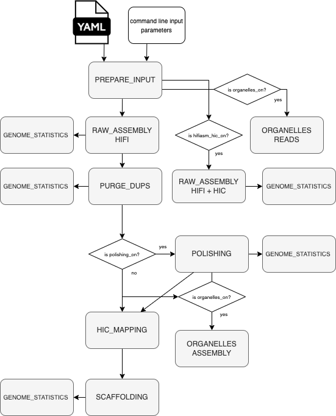

# Summary

Nucleotide sequencing technologies have facilitated development of the genomics field since 1960s.
Sequencing and assembly of the first human genome was one of the crucial milestones in its history.
This project launched in 1990 and completed in 2003.
In the last decades owing to the rapid development of the sequencing technologies producing a full genome sequence reduced from years to days.
However technological handicaps constrain uninterrupted reading through the whole chromosome which leads to the algorithmic problem of genome assembly.
The existing approaches to tackle this problem are defined by properties of the processed biological data, as much as the exploited sequencing technologies and the scope and scale of the underlying genome projects.\
The Darwin Tree of Life (DToL) project aims to produce reference full-genome assemblies of 70,000 eukaryotic species of Britain and Ireland.
DToL production relies on the PacBio HiFi technology which facilitates highly accurate and continuous reads and Illumina HiC method allowing for capture of the three dimensional interactions of DNA molecules.
Best practices evolved in the ToL assembly production were implemented as a nextflow workflow.

# Statement of need

The DToL production assembly pipeline is based on the experience accumulated from the assembly process of more than 1,500 genomes of eukaryotic organisms from different clades.
_genomeassembly_ workflow written in nextflow DSL 2 workflow language follows the DToL production assembly pipeline while making advantage of the nf-core workflow management functionality.
The aim of the workflow is to produce a genome assembly good enough to be manually curated into a reference assembly meeting the widely acknowledged Earth Biogenome Project (EBP) standards.\
The nextflow workflow was designed to be of use for the bioinformatic community under the MIT lisence.
It is highly portable and configurable to be run on various workload managing platforms through the nextflow configuration profiles.

# Pipeline overview

The pipeline takes as input raw HiFi and HiC sequencing data and a set of metadata (\autoref{fig:diagram}).\
The HiFi reads are assembled into the raw primary and haplotypic sequences with hifiasm. It follows with an extra round of purging with purge_dups where the hifiasm primary assembly is further purged from the remained haplotypic sequences.
Depending on availability of Illumina 10X data it can then be optionally followed with polishing of primary and haplotypic sequences with Longranger.
The sequences representing primary assembly then scaffolded up using HiC data. HiC reads are mapped with bwa-mem2 which is further passed over into yahs for scaffolding.\
A separate subworkflow covers organelles assembly.
Another optional feature implements an alternative way of producing the raw assembly from the joint HiFi and HiC data in hifiasm HiC mode.\
At every intermediate stage of the assembly its quality characteristics are produced.
These include quantitative metrics produced by GFAstats, kmer frequency plots produced by MerkqurFK and universal single-copy orthologs representation rate calculated by BUSCO.\
Along with that the final assembly is also complemented with the HiC maps in various formats (.pretext, .hic, .cload) usable for viewing and following up the assembly with manual curation. 

{ width=70% }

# Future developemnt

The implementation of the following releases will cover:

- another entry point into the pipeline for running HiC data mapping and scaffolding of the provided contigs
- running only assembly of organelles
- running hifiasm in trio mode
- facilitating assembly of the haploid genomes
- necessary modifications for processing large genomes (>3Gb)
